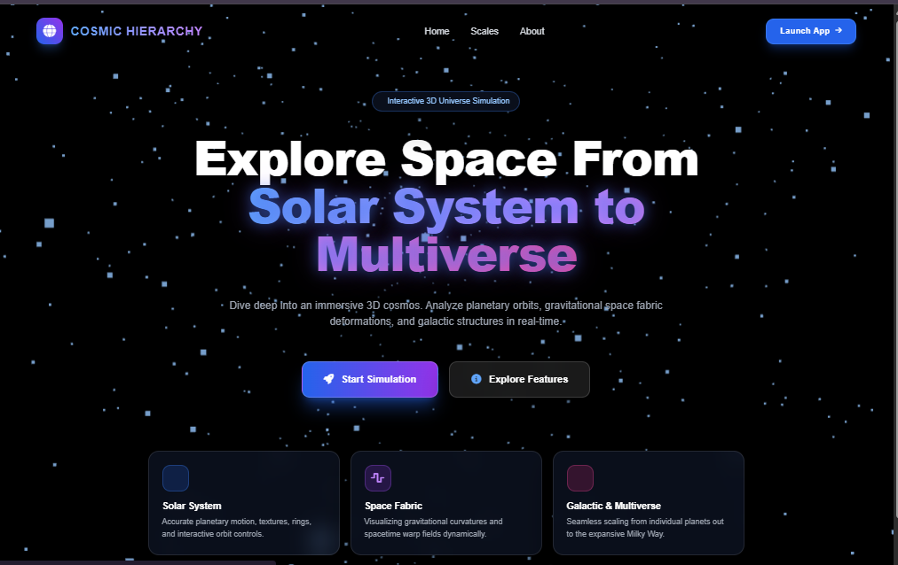

# 🌌 Cosmic Hierarchy & Interactive 3D Universe Simulator

[](https://threejs.org/)
[](https://tailwindcss.com/)
[](https://greensock.com/)
[](https://opensource.org/licenses/MIT)

An immersive, high-performance real-time 3D interactive web application built with **Three.js** that visualizes the vast hierarchical scales of the universe—ranging from microscopic sub-system phenomena and full planetary solar systems to massive galactic structures, supermassive black holes, and multi-dimensional domains.

---

## 📋 Table of Contents

1. [Overview & Key Features](#-overview--key-features)
2. [Tech Stack & Architecture](#️-tech-stack--architecture)
3. [Installation & Local Setup](#-installation--local-setup)
4. [Controls & Interaction Guide](#-controls--interaction-guide)
5. [Interface Preview & Live Demo](#-interface-preview--live-demo)
6. [Reviews & Feedback](#-reviews--feedback)
7. [Contributing & License](#-contributing--license)

---

## 🚀 Live Demo & Preview

Experience the interactive simulation live in your browser right now! Click the links below to access or preview the application:

- **🌐 Live Web App URL:** [https://threed-solar-system-eoff.onrender.com](https://threed-solar-system-eoff.onrender.com)
<p align="center">
  
</p>
> _Note: Replace the placeholder URLs with your actual Render deployment link and live preview/hosting URL._

---

## 🌟 Overview & Key Features

- **Multi-Tier Cosmic Scale:** Seamlessly zoom and navigate through different cosmological tiers, including the Solar System, the Milky Way Galaxy, Supermassive Black Holes, and Multiverse domains.
- **Realistic Orbital Mechanics:** Interactive 3D planets featuring accurate procedural canvas textures, custom lighting models, independent axial rotations, and configurable simulation speeds.
- **Interactive Space Fabric (Spacetime Grid):** High-poly dynamic mesh that deforms in real-time based on the gravitational mass of the Sun and orbiting celestial bodies.
- **Cinematic Camera Control & GSAP Animation:** Smooth, automated camera transitions and responsive controls to target specific celestial bodies instantly with zero lag.
- **Custom Glassmorphism UI:** Modern, collapsible dashboard panel built with Tailwind CSS and FontAwesome icons for easy controls, zoom adjustments, and scale switching.

---

## ⚙️ Tech Stack & Architecture

- **Core Rendering:** JavaScript (ES6+), WebGL via Three.js (v0.160.0)
- **Camera & Scene Controls:** Three.js `OrbitControls` with custom damping and boundary limits
- **Animations & Tweens:** GSAP (GreenSock Animation Platform v3.12.5) for smooth camera interpolation and UI transitions
- **Styling Framework:** Tailwind CSS for modern responsive utility-first layout design
- **Icons & Assets:** FontAwesome v6.4.0

### Project Directory Structure

```text
├── index.html         # Optional landing page or additional interface
├── assets/            # Folder containing textures, icons, and other static assets
|     └── UI.png         # UI preview image
├── space.html         # Main entry point with UI layout and import maps
├── style.css          # Custom glassmorphism styles and UI animations
├── README.md          # This file
└── script.js          # Core simulation logic, procedural texture generators, and animation loop
```

## 📄 License

This project is licensed under the MIT License.

## 📝 Author

👤 **Amir Sohail**

---
